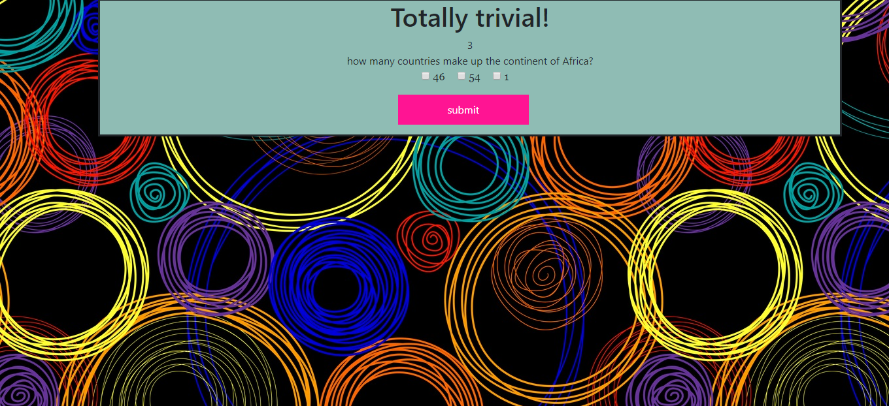

### Project Title
   Trivia Game 

 ## OVERVIEW  

this is basic trivia game with multiple choice.
The player will have a limited time to finish the game. When the time runs out (regardless of whether or not they finished), the game will end and they will be shown the number of answers they got correct and incorrect.
There is a counting down the remaining time.
The player should NOT be able to pick more than one answer for each question.  

## TECHNOLOGIES 
- html 
- css 
- Javascript 
- bootstrap 
- jquery 

## lINK
- https://github.com/israel81boot/TriviaGame

 

## AUTHOR
- Israel Dembele 
